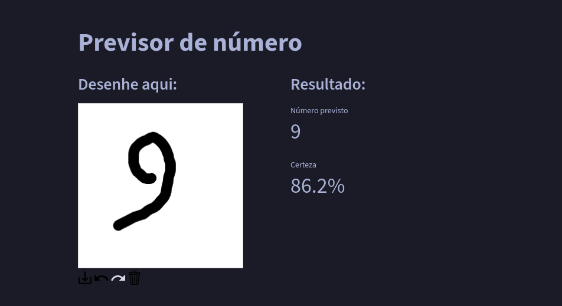

# Previsor de número

Um projeto voltado ao estudo de IA com **Tensorflow**, apenas precisa desenhar no canvas do site o número de 0 a 9 e o modelo treinado localmente ira dizer qual número foi feito.

## Screenshots

